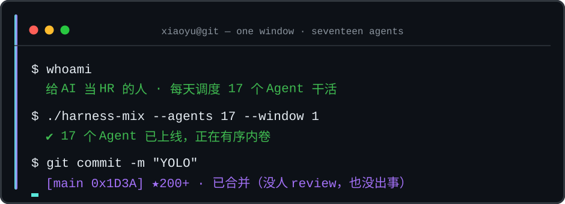

  
   
  

---

### `$ whoami`

三年开发经验的 **AI Agent 开发工程师**，专注于 AI Agent 与企业级项目的结合落地：从需求拆解、多 Agent 编排，到 RAG 知识库、评测观测与上线交付，负责全链路。

> 🔭 正在折腾 [harness-mix](https://github.com/emo-xiaoyu/harness-mix) —— 一个窗口调度 17 个 Coding Agent 的本地内核

### 🧰 Tech Stack

**语言**

**Agent 框架与编排**

**评测与可观测**

**RAG 与知识工程**

### 📦 作品

**[harness-mix](https://github.com/emo-xiaoyu/harness-mix)** —— 把 17 个原生 Coding Harness 塞进 Codex Desktop 同一窗口的本地内核：任务接力、互相评审、团队编排

**[snipaste-pro](https://github.com/emo-xiaoyu/snipaste-pro)** —— Pasty：Windows 本地剪贴板工具，自动记录文本 / 图片 / 文件，全局快捷键秒呼历史

### 贪吃蛇正在吃我的提交

  <picture>
    <source media="(prefers-color-scheme: dark)" srcset="https://raw.githubusercontent.com/emo-xiaoyu/emo-xiaoyu/output/github-contribution-grid-snake-dark.svg" />
    
  </picture>

